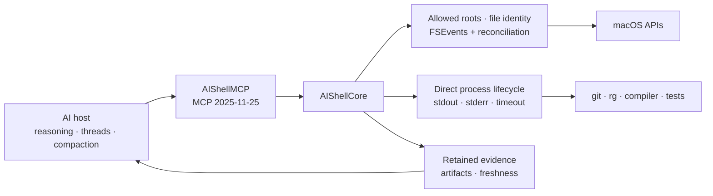

<p align="center">
  
</p>

# AIShell

[](https://github.com/kitepon-rgb/aishell/actions/workflows/ci.yml)
[](https://www.npmjs.com/package/@quolu/aishell)


> AI開発hostへfreshなworkspace state、budget付きcontext、保持された実行証拠を渡すmacOS-native MCP runtime。すべての操作をshell文字列へ潰さず、OSに面する状態をモデルより下で所有する。

[English](README.md)

AIShellは許可root、file identity、filesystem照合state、直接起動したprocess、完全log、artifactを所有する。reasoning、thread、compaction、sub-agent、汎用terminalはAI hostの責務として残す。

## 30秒で試す

Apple Silicon Mac、macOS 15以降が必要。

```sh
npm install -g @quolu/aishell
aishell-open
codex mcp add aishell -- /opt/homebrew/bin/aishell-mcp
```

管理アプリでAIに許可するfolderを追加し、新しいCodex taskで次のように頼む。

```text
初回workspace contextはworkspace_snapshotで取得して。focused testはrun_checkで実行し、
summaryから省略された証拠だけartifact_readで読んで。
```

既定profileは5本の高密度development toolと、常時利用できる2本の復旧control toolを提供する。

| Tool | 役割 |
|---|---|
| `workspace_snapshot` | boundedな初回preview、照合済み変更delta、Git状態、主要context |
| `read_context` | SHA-256 identityとcontinuationを持つbudget付き複数file read |
| `search_context` | 直接起動した`rg` workerによるbudget付き検索context |
| `run_check` | 直接process実行、主要diagnostic、完全stdout/stderr artifact |
| `artifact_read` | 保持artifactのrange、tail、pattern周辺read |
| `runtime_status` | 未設定・停止中も含む許可root、停止、worktree、次操作の状態取得 |
| `runtime_open_manager` | root追加またはAI操作再開のため管理アプリを開く |

## なぜAIShellか

statelessな連携では、モデルがworkspaceを何度もscanし、command出力から状態を再構成しやすい。AIShellは状態を持つOS側の仕事をモデルより下へ置き、後続turnが全再scanではなくdeltaと一次証拠を要求できるようにする。

| 論点 | AIShell | 一般的なshell-first連携 |
|---|---|---|
| Workspace state | file identity＋filesystem観測と照合 | commandを再実行してtextから再構成 |
| Context | budget・cursor付きstructured result | stdoutを手動または暗黙に切り詰める |
| Execution | executable URL、引数、cwd、lifecycleを分離 | shellが1本のcommand文字列を評価 |
| Evidence | 完全stdout/stderrを期限付きhandleで保持 | response truncation時に証拠が失われやすい |
| Scope | 人が管理する許可rootと明示的stop状態 | 周囲のshellとhost policyに依存 |

AIShellはsandboxではなく、任意code実行を安全化しない。process railの目的はtyped executionと観測可能なlifecycleを維持することであり、改名binaryや許可workerが起動する子processを阻止することではない。

## Architecture



`AIShellCore`がdomain挙動を所有し、`AIShellMCP`はprotocol request/resultだけを変換する。Git、ripgrep、compiler、test、SourceKit-LSPは新しいstate ownerにせず、直接起動するworkerとして再利用する。

## npmからinstall

global packageは`aishell-mcp`と`aishell-open`を`PATH`へ追加する。`aishell-open`は同梱された管理アプリをLaunchServicesで開く。install scriptは実行しない。

```sh
npm install -g @quolu/aishell
aishell-open
```

現在の実験版はDeveloper ID署名・notarization前である。

## Sourceからbuild

```sh
git clone https://github.com/kitepon-rgb/aishell.git
cd aishell
swift test
scripts/package-app.sh release
open build/AIShell.app
```

MCP実行ファイルは`build/AIShell.app/Contents/Helpers/aishell-mcp`へ同梱される。

管理アプリの「許可rootを追加」でAIに操作させるfolderを選ぶ。許可済みGit repositoryの`.git/worktrees`へ正式登録され、双方の管理情報が一致するworktreeは自動的に実効rootへ加わる。

## 別のAI hostへ接続

Homebrew prefixへnpm installした場合は絶対pathを登録する。

```sh
codex mcp add aishell -- /opt/homebrew/bin/aishell-mcp
codex mcp get aishell
```

解除:

```sh
codex mcp remove aishell
```

互換用full profileは全25 toolを提供する。既定7本は5本のdevelopment toolと2本の復旧control toolで、full modeは残りのlegacy primitiveも公開する。

```sh
AISHELL_TOOL_PROFILE=full /opt/homebrew/bin/aishell-mcp
```

full profileにはfile一覧・read、SHA-256競合検出付きatomic update、copy/move/rename/Trash、直接process実行、app discovery/launch、runtime status、管理アプリの前面化が含まれる。

## 実行と安全性の境界

- shell command文字列を評価しない。開発programを`PATH`からexecutable URLへ解決し、arguments、environment、working directoryと分離する。
- `sh`、`bash`、`zsh`、`env`、`osascript`等のbasename直接起動を製品上のrailとして拒否する。security boundaryとして宣伝しない。
- `run_check`はopen-world capabilityであり、許可workerはfile更新・子process・network accessを行い得る。AI hostによっては実行承認が必要になる。
- text更新はSHA-256または旧textを事前条件にできる。削除はTrashへ送る。
- 管理アプリから通常操作を一括停止できる。停止中もruntime statusと管理アプリの前面化は利用できる。

## 現在の制限

- stdio serverは1 requestずつ処理する。
- MCP cancellationと並列run pollingは未実装。
- timeout時は直接所有するprocess treeを終了するが、終了までに許可workerがopen-worldな副作用を起こし得る。
- 初回workspace entryはbounded previewで、後続deltaはcursor pageになる。
- Developer ID署名とnotarizationは未設定。

## 開発検証

```sh
swift test
scripts/package-app.sh release
```

`xcodegen generate`で`AIShell.xcodeproj`を再生成できる。実装の正本は`Sources/AIShellCore`、`Sources/AIShellMCP`、`Sources/AIShellApp`、focused testは`Tests/`に置く。

<details>
<summary>ローカルXcode検証時の注記</summary>

初回検証機ではXcode 26.6とCoreSimulatorのbuild versionが一致せず、`xcodebuild`はXCBuild開始前に停止した。同じSwift 6.3.3 toolchainを使うSwiftPMは通過した。このhost問題はsourceの成功扱いへ混ぜていない。

</details>

## ContributionとSecurity

変更提案前に[CONTRIBUTING.md](CONTRIBUTING.md)を確認してほしい。脆弱性はpublic issueへ書かず、[SECURITY.md](SECURITY.md)のprivate経路で報告する。

release notesは[`docs/`](docs/)に置き、GitHub Releasesを公開済みversionの正本とする。

## License

AIShellは[Apache License 2.0](LICENSE)で公開している。
