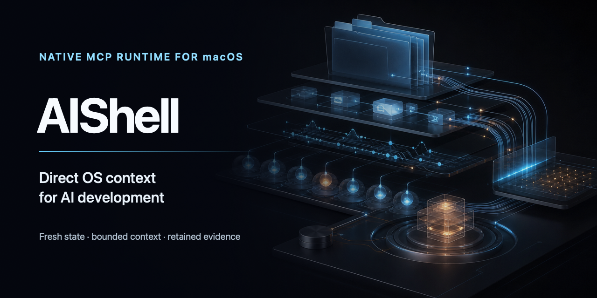
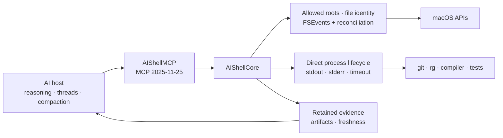

<p align="center">
  
</p>

# AIShell

[](https://github.com/kitepon-rgb/aishell/actions/workflows/ci.yml)
[](https://www.npmjs.com/package/@quolu/aishell)


> A macOS-native MCP runtime that gives AI development hosts fresh workspace state, bounded context, and retained execution evidence—without collapsing every operation into a shell string.

[日本語](README.ja.md)

AIShell owns the OS-facing state below the model: allowed roots, file identity, filesystem reconciliation, directly launched processes, complete logs, and retained artifacts. The AI host remains responsible for reasoning, threads, compaction, sub-agents, and general-purpose terminal work.

## Try it in 30 seconds

Requires an Apple Silicon Mac running macOS 15 or later.

```sh
npm install -g @quolu/aishell
aishell-open
codex mcp add aishell -- /opt/homebrew/bin/aishell-mcp
```

In the manager app, add the folders the AI may access. Start a new Codex task and try:

```text
Use workspace_snapshot for the initial workspace context. Run the focused tests with
run_check, and read retained output with artifact_read only if the summary omits evidence.
```

The default profile exposes five high-density development tools plus two always-available recovery controls:

| Tool | Purpose |
|---|---|
| `workspace_snapshot` | Bounded initial workspace preview, reconciled change delta, Git state, and primary context |
| `read_context` | Budgeted multi-file reads with SHA-256 identity and continuation |
| `search_context` | Budgeted search context produced by a directly launched `rg` worker |
| `run_check` | Direct process execution, primary diagnostics, and complete stdout/stderr artifacts |
| `artifact_read` | Range, tail, and pattern-centered reads from retained artifacts; the expanded capability also searches and compares finalized managed-run artifacts |
| `runtime_status` | Allowed-root, pause, worktree, and next-action state, including while paused or unconfigured |
| `runtime_open_manager` | Open the manager app to add roots or resume AI operations |

Set `AISHELL_CAPABILITY_SET=expanded-v1` on the MCP server process to opt in to the candidate surface. In that mode, `run_check` can start a managed run, `run_observe` can read or wait for it independently of the originating MCP request, and `artifact_read` adds closed `search`, `next`, and `compare` actions. Cross-run artifact operations require an explicit project path and reject live, expired, legacy-unbound, or different-project evidence instead of silently falling back to partial logs.

## Why AIShell

Typical stateless integrations repeatedly ask the model to rediscover workspace state and interpret command output. AIShell keeps the stateful, OS-facing part below the model so later turns can ask for deltas and primary evidence instead of rescanning everything.

| Concern | AIShell | Typical shell-first integration |
|---|---|---|
| Workspace state | File identity plus filesystem observation and reconciliation | Re-run commands and reconstruct state from text |
| Context | Bounded, cursor-based structured results | Unbounded or manually truncated stdout |
| Execution | Executable URL, arguments, working directory, and lifecycle remain separate | A shell evaluates one command string |
| Evidence | Complete stdout/stderr retained behind expiring handles | Evidence often disappears when the response is truncated |
| Scope | Human-managed allowed roots and explicit stop state | Depends on the surrounding shell and host policy |

AIShell is not a sandbox and does not make arbitrary code execution safe. Its process rails exist to preserve typed execution and observable lifecycle—not to stop renamed binaries or child processes launched by an allowed worker.

## Architecture



`AIShellCore` owns domain behavior. `AIShellMCP` only translates protocol requests and results. Git, ripgrep, compilers, tests, and SourceKit-LSP remain directly launched workers rather than becoming new state owners.

## Install from npm

The global package adds `aishell-mcp` and `aishell-open` to `PATH`. `aishell-open` opens the bundled manager app through LaunchServices. The package runs no install script.

```sh
npm install -g @quolu/aishell
aishell-open
```

The current experimental build is not yet Developer ID signed or notarized.

## Build from source

```sh
git clone https://github.com/kitepon-rgb/aishell.git
cd aishell
swift test
scripts/package-app.sh release
open build/AIShell.app
```

The MCP executable is bundled at `build/AIShell.app/Contents/Helpers/aishell-mcp`.

After opening the app, use **Add Allowed Root** to select the folders AIShell may access. A Git worktree registered under an allowed repository is recognized automatically when both sides of the worktree metadata agree.

## Connect another AI host

For a Homebrew-prefix npm installation, register the absolute executable path:

```sh
codex mcp add aishell -- /opt/homebrew/bin/aishell-mcp
codex mcp get aishell
```

Remove the registration with:

```sh
codex mcp remove aishell
```

The compatibility profile retains all 25 tools. The default seven are the five development tools plus the two recovery controls; full mode adds the remaining legacy primitives:

```sh
AISHELL_TOOL_PROFILE=full /opt/homebrew/bin/aishell-mcp
```

The full profile includes file listing and reads, atomic SHA-256-guarded updates, copy/move/rename/Trash, direct process execution, app discovery and launch, runtime status, and manager activation.

## Execution and safety boundaries

- AIShell never evaluates a shell command string. It resolves a development program from `PATH` to an executable URL and keeps arguments, environment, and working directory separate.
- Direct launch of shell and wrapper basenames such as `sh`, `bash`, `zsh`, `env`, and `osascript` is rejected as a product rail, not advertised as a security boundary.
- `run_check` is an open-world capability: an allowed worker may update files, launch child processes, or access the network. AI hosts may require approval before execution.
- npm projects may opt a `build`, `test`, or `lint` check into freshness caching with the closed
  direct-Node `package.json` declaration documented in `docs/adr/0009-project-profile-contract.md`. Ordinary npm
  scripts remain executable but cache-ineligible; AIShell does not infer arguments, inputs, or effects
  from shell script text.
- Text updates may use SHA-256 or expected old text as a precondition. Deletes go to Trash.
- The manager app can stop normal operations globally. Runtime status and manager activation remain available while stopped.

## Current limitations

- The stdio server handles one request at a time.
- MCP cancellation and concurrent run polling are not implemented.
- A timeout terminates the directly owned process tree, but an allowed worker remains capable of open-world side effects before termination.
- Initial workspace entries are a bounded preview; later deltas are cursor-paged.
- Developer ID signing and notarization are not yet configured.

## Development

```sh
swift test
scripts/package-app.sh release
```

Run `xcodegen generate` to regenerate `AIShell.xcodeproj`. The authoritative implementation lives under `Sources/AIShellCore`, `Sources/AIShellMCP`, and `Sources/AIShellApp`; focused tests live under `Tests/`.

<details>
<summary>Local Xcode verification note</summary>

On the original verification machine, Xcode 26.6 and the installed CoreSimulator build version did not match, so `xcodebuild` stalled before XCBuild began. The same Swift 6.3.3 toolchain passed through SwiftPM. That host issue was not counted as source success.

</details>

## Contributing and security

See [CONTRIBUTING.md](CONTRIBUTING.md) before proposing a change. Please report vulnerabilities through the private process in [SECURITY.md](SECURITY.md), not through a public issue.

Release notes are kept in [`docs/`](docs/). GitHub Releases are the public record for shipped versions.

## License

AIShell is licensed under the [Apache License 2.0](LICENSE).
