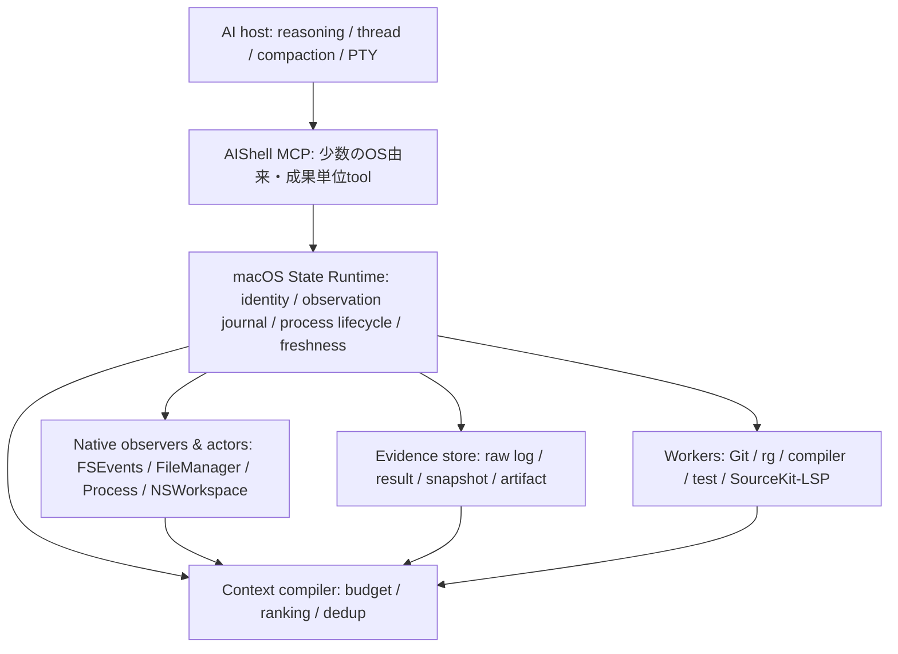

# AIShell macOS直結・開発効率ランタイム 開発計画

## 0. 決定

2026-07-19時点で初期高密度5 tool、default development profile、full互換profile、隔離benchmark runnerまで実装済み。最終candidate `a0c22c3` の同一binary・manifest・runnerによる3 sentinel × 3反復では両arm 9/9成功し、AIShellは`tokens per solved task`を25.86%、平均wall timeを32.59%削減したためM1 gateを通過した。これはbypass隔離fixture上の小規模sentinelであり、30 task代表suite、semantic context、product targetは未着手。本roadmap全体の完了扱いにはしない。

AIShell 0.2.1で成立したDirect OS基盤を、次の製品仮説へ発展させる。

> **macOSの生きたfilesystem・process・worktree・artifact状態を直接所有し、その状態からAI開発に必要な最小の情報と操作を生成するランタイム。**

Direct OSは宣伝文句でも交換可能なbackendでもなく、効率化を生むアーキテクチャ上の根である。AIShellがfile identity、変更履歴、process lifecycle、stdout/stderr artifact、許可root、Git worktreeをモデルより下で直接保持するから、全量の再観測と巨大なtool outputを省ける。

これはcompiler、Git、`rg`、LSPを再実装するという意味ではない。専門toolはAIShellが直接起動・監視するworkerとして借り、AIShellがOS状態、lifecycle、freshness、artifact、AI向け圧縮結果を所有する。OS状態を所有しなくても成立する便利機能はAIShellへ詰め込まない。

shell群、`env`、`osascript`のbasename拒否は、公開面を汎用command runnerへ退行させず、この状態所有経路へAIを誘導する設計レールである。これはsecurity boundaryではなく、改名binaryや許可workerが起動する子processを封じるものではない。安全性や隔離の根拠としてこの拒否listを使わない。

この文書は今後の開発ロードマップの正本である。[Direct OS Spike](direct-os-spike.md)は0.2.1までの完了済み技術スパイクとして保存し、同文書の「次の段階」にあるGUI/Accessibility拡張は本計画で置き換える。

### 統括campaignの境界

本計画は受入が複数Phaseに連鎖するため、`orchestrate` の統括レーンで実行する。作業分類は次で固定する。

- **F（親が裁定）**: 公開MCP契約、OS状態のidentity/cursor/freshness意味論、evidence retention、互換性、benchmark gate、各Phaseのaccept/reject。
- **A（仕様固定後に実装可能）**: benchmark runner、process/evidence基盤、5本のtool、FSEvents観測、focused test、fixture、文書同期。初期の共有coreは親が直列に実装し、委譲する場合だけPacket/ReportとLatticeを使う。
- **H（人の承認が必要）**: push、release、notarization、配布先や外部環境への変更。本campaignの完了条件には含めず、明示承認なしに実行しない。

独立TODOは複数あるが、Phase 1とPhase 2は同じstate runtimeとMCP schemaを連続して変更する。したがって初期実装は直列とし、read-only調査・Phase gateの反証だけを並列化候補にする。同一repoのwriterを並列化する場合はLatticeが利用可能でscopeが非交差な時だけ許可する。

## 1. 優先順位と製品契約

優先順位は固定する。

1. 課題の成功と変更の正しさ
2. 成功課題あたりの総model token
3. wall timeとmodel/tool往復数
4. host、MCP、既存利用者との互換性
5. 安全性は現在のroot制限、停止、Trash、競合検出を床として維持

token削減のために成功率を落とさない。完全ログを削除して短く見せない。失敗を要約から隠さない。削減を主張する前に、同一条件のpaired benchmarkを通す。

### North-star metric

armごとの主KPIは、失敗試行で消費したtokenも分子へ残す。

```text
tokens per solved task = 全試行のtotal model tokens合計 / oracle成功数
```

成功数が0なら無限大として不合格にする。補助値として、両armが成功したtask共通集合のpaired token ratioと、baseline-pass taskの回帰も出す。成功した試行だけを後から選んだ中央値を主KPIにしない。

Codexのprovider-reported usageでは、主集計を次とする。

```text
total model tokens = input_tokens + output_tokens
```

`cached_input_tokens`は`input_tokens`の内数、`reasoning_output_tokens`は`output_tokens`の内数として別列に出し、二重加算しない。providerが`cache_write_tokens`を報告する場合も、費用分析用の別列に置く。別hostで意味が異なる時はadapterに算定式と内数関係を明記する。

cached inputはcontext windowから消えたtokenではない。料金、latency、context量を同じ指標へ混ぜない。

### 補助指標

- 成功率、baseline-pass課題の回帰数
- p50/p95 wall time、first useful result
- tool call数、model turn数、retry数
- model-visible tool result bytes/token
- truncation、cursor expiry、artifact再読、compaction回数
- cost / solved task
- context retrieval recall、precision、stale-after-edit correctness
- filesystem entries rescanned、bytes reread、process reexecution、change-journal hit率

## 2. 今回は作らないもの

- 独自AI agent、model hosting、thread/session/compaction基盤
- 汎用shell grammar、PTY、Terminal代替
- GUI操作、Accessibility、画面認識の拡張
- 独自tool search/router（host側のdeferred discoveryを先に使う）
- parser、compiler、汎用多言語semantic indexの再実装
- OS状態の直接所有と無関係な汎用AI開発toolの寄せ集め
- permission engine、署名client認証、細粒度grantの先行強化
- 外部論文やvendor benchmarkの削減率をAIShell実績として掲げること

既存の20 primitive、macOS管理アプリ、root制限は直ちに削除しない。新しい高密度経路の下位実装またはlegacy profileとして利用し、移行はbenchmarkと互換性probeの後に行う。

## 3. 現状baseline

2026-07-19のローカル調査で、次を確認した。

| 現状 | 観測値または挙動 | 改修仮説 |
|---|---|---|
| MCP catalog | 20 tools、`tools/list` 10,119 bytes | hostのdeferred loadingを先にprobe。tool数だけを目的に減らさない |
| result encoding | 同じJSONをTextContentと`structuredContent`へ併記 | host別のmodel-visible tokenを測り、互換性を保って縮小 |
| structured result | `outputSchema`なし、一部top-level array | stable MCPに沿うobject envelopeへ統一 |
| file read | 最大1 MiBのUTF-8全文 | range、budget、SHA、cursor付きreadへ変更 |
| process output | stdout/stderr各最大1 MiBを本文返却 | 短い診断 + durable artifact handleへ変更 |
| process artifact | 終了時にscratch削除 | TTL/quota付きevidence storeへ保存 |
| search/tree | 打切り件数はあるが継続情報なし | omitted、`has_more`、opaque cursorを返す |
| request handling | 長時間process中は同一接続を占有 | request受付とjob実行を分離 |
| bootstrap | initialize instructionsが最初の`runtime_status`を推奨 | 実call率を測り、追加往復になっている場合だけ通常resultへ統合 |

この値はwire上のbaselineであり、token削減実績ではない。正しいbaselineはPhase 0でCodexのusage eventから採取する。

## 4. 機能採用基準と目標アーキテクチャ

新機能は、次の順で判定する。

1. macOSの生きた状態を直接観測・保持することで、再読、再scan、再実行、model往復を減らせるか。
2. file、process、worktree、artifactのうち複数を結合することで、一段高密度な結果を返せるか。
3. 既存専門toolをworkerとして借り、AIShell固有部分をOS state runtimeへ限定できるか。

1を満たさない単なる便利toolは採用しない。2を満たさない薄いwrapperも、既存host toolより明確に効率化できない限り公開しない。



### 所有境界

| 所有する | 所有しない |
|---|---|
| file identity、許可root、worktree、FSEvents観測とfilesystem照合状態 | 会話履歴、推論、sub-agent、compaction |
| 直接起動したprocessのlifecycle、timeout、exit、完全ログ | 汎用shell grammar、Terminal、PTY session |
| workspace cursor、freshness、content hash、artifact lifecycle | compiler、Git、`rg`、LSP本体 |
| OS状態とworker結果を横断した圧縮・順位付け | modelのplanning、長期memory |

### 共通result envelope

すべての高密度toolはstable MCP 2025-11-25に合わせ、top-level objectと`outputSchema`を持つ。

```json
{
  "status": "failed",
  "summary": "型変更後、3箇所が旧signatureのまま",
  "evidence": [
    {
      "path": "Sources/A.swift",
      "line": 42,
      "kind": "compiler_error",
      "message": "missing argument"
    }
  ],
  "artifact": {
    "handle": "aishell://runs/abc/stderr",
    "bytes": 91240,
    "sha256": "...",
    "expires_at": "2026-07-20T00:00:00Z"
  },
  "omitted": {
    "lines": 1842,
    "bytes": 88012
  },
  "freshness": {
    "workspace_cursor": "c17",
    "index": "ready"
  },
  "meta": {
    "request_id": "...",
    "duration_ms": 1842
  }
}
```

契約:

- 成功は短く、失敗はprimary diagnosticと位置を優先する。
- 省略量と`expires_at`を明示し、advertised retention中は完全な一次証拠を保持する。
- cursor、handle、error codeはopaqueかつstableに扱う。
- `CURSOR_EXPIRED`、`CONTENT_CHANGED`、`INDEX_STALE`を黙って回避しない。
- backend切替が必要なら結果へ経路と理由を出す。
- schema、tool順、descriptionは決定的に保ち、動的状態を混ぜない。

### 初期の高密度tool surface

| Tool | 一回で返す成果 | OS直結による固有価値 |
|---|---|---|
| `workspace_snapshot` | repository構造、Git状態、変更、主要entry point、前cursorからのdelta | FSEventsで変更候補を受け、現在のfile identity/hash、許可root、worktreeと照合 |
| `search_context` | 本文snippet、symbol、関連test、変更近接性をbudget内で順位付け | OS変更journalをtask relevanceへ使い、`rg`/LSPはworkerとして合成 |
| `read_context` | 複数file/symbolの必要range、SHA、継続cursor | coordinated read、file identity、内容hashでstale readを防ぐ |
| `run_check` | focused build/test、成功要約、主要診断、完全log handle | executable URLと引数を直接起動し、process lifecycleと出力artifactを所有 |
| `artifact_read` | handleのline/byte range、tail、pattern周辺 | OS側に保持した完全artifactから必要範囲だけをlossless read |

`changes_since`は最初は`workspace_snapshot(since_cursor:)`へ統合する。`inspect_failure`は`run_check`のresult解析へ統合する。`apply_patch`はhostの既存patch能力より改善できる場合だけ追加する。

## 5. Benchmark契約

### 比較arm

| Arm | 内容 | 目的 |
|---|---|---|
| A | AIShellを使わないCodex標準tool | 実際の競争相手となるbaseline |
| B | 現行AIShell 0.2.1 | 現実装の増減を把握 |
| C | macOS State Runtime版AIShell | OS状態所有から生まれる圧縮効果を測る |

各taskは同一model snapshot、reasoning effort、prompt、repository fixture、sandbox、timeout、output capで実行する。arm順はtask単位で無作為化し、反復を独立taskとして水増ししない。

runnerは全armで`--ignore-user-config`と`--ignore-rules`を使い、グローバルMCP、profile、hook、memoryの混入を防ぐ。arm AはMCPなし、arm B/Cは対象AIShellだけを明示configで注入する。project `AGENTS.md`とsystem instructionsは全armで同一にし、実際に読み込まれたconfig、MCP、hook、plugin、rulesのmanifestをrun recordへ保存する。`--ephemeral`はsession非永続化のために使い、設定隔離の代用にはしない。

prompt cacheの強制hit/missをCodex CLIだけで保証できるとは仮定しない。primary token比較はprovider-reported総inputをそのまま使い、費用とlatencyは観測された`cached_input_tokens / input_tokens`で事後層別する。cache key等を制御できるAPI経路を実証できた場合だけcold/warm suiteを別にする。

### 計測経路

- `codex exec --json --ephemeral`をbenchmark runnerから起動する。
- JSONLの`turn.completed.usage`からinput、cached input、output、reasoning tokenを採取する。
- MCP境界でrequest ID、tool、duration、wire bytes、omitted bytes、artifact readを記録する。
- model-visible bytesをhostから取得できない場合は「未計測」とし、wire bytesでtokenを断定しない。
- 必要な場合だけCodex OpenTelemetryの`codex.sse_event`と`codex.tool_result`を追加する。
- tokenizer推定値は`provider_reported: false`として別列に置く。

### Task suiteを二つに分ける

Product gateには、機能案に都合のよい課題だけを入れない。Phase 1の製品判定までに、実利用履歴から次の代表カテゴリを10〜20件凍結し、最終評価では30件以上へ拡張する。

- 小さなcode location・説明
- 1 fileの修正
- compile/test failureを伴うbugfix
- 2〜3 fileの変更
- repository横断のrefactor
- test追加
- docs/config変更
- 既存toolだけで短く終わる課題

この**代表end-to-end suite**だけをproduct token/time gateに使う。task分布、fixture commit、prompt、oracle、許可変更範囲、timeoutを実装前に固定する。成功判定は最終文の自己申告ではなく、test、expected diff、正答setなどのdeterministic oracleで行う。

次は**capability microbench**として分離し、局所回帰と設計裁定にだけ使う。

- 長いbuild logから最初のactionable diagnosticを特定する。
- 100 KB〜数MiBのlogからpattern周辺だけを読む。
- 巨大repositoryの検索・range readを行う。
- workspace delta、rename、deleteを追う。
- stale SHA、stale index、expired cursor/handleを誤用しない。
- Git worktreeのrootと変更を扱う。

Phase 0では、この代表suite全体を待たず、code change、compile/test failure、反復workspace観測の3 sentinelだけを各armで測る。これは実装前の桁と計測経路を確かめるengineering baselineであり、製品削減率には使わない。Phase 1の縦切り後に代表suiteを各arm最低3反復し、varianceとM1を判定する。統計単位はtaskとし、反復数をtask数として数えない。

### OS状態所有の寄与を分離する

高密度toolごとに、保持したOS状態を使う経路と、同じworkerを毎回statelessに呼ぶ経路をcapability microbenchで比較する。`workspace_snapshot`なら全量scan対FSEvents delta、`run_check`ならraw process output対OS-owned artifact、`search_context`なら全repository検索対change-journal優先順位付けを比較する。

総tokenだけでなく、再scan件数、再読byte、追加process実行、model往復を記録する。OS状態所有に寄与がなく、既存toolを包んだだけの機能は採用しない。

### 暫定gate

数値gateはこの計画で先に固定する。代表suiteのtask、非劣性margin、必要標本数、集計方法はPhase 1の実装結果を見る前に登録し、その後都合よく動かさない。

- Correctness: 固定core suiteではbaselineが成功したtaskを1件も落とさない。拡張suiteの非劣性marginと必要標本数はPhase 1実装前に事前登録する。
- M1 adoption: 代表suiteの`tokens per solved task`を20%以上削減する。
- Product target: 代表suiteの`tokens per solved task`を30%以上削減する。
- Time gate: p50 wall timeを悪化させず、p95の悪化を10%以内にする。product stretch targetはp50を15%以上短縮する。
- Integrity: silent truncation、一次証拠消失、cursorの黙ったfull fallbackを0件にする。

機構の診断目標として、model-visible tool result token 40%削減、tool call中央値30%削減も追う。ただし総tokenと時間がgateを通るなら、これら単独をrelease blockerにはしない。

これらは外部研究の転用値ではなく、AIShellの製品gateである。Phase 0で計測不能と判明した指標だけ、Phase 1実装前に理由と代替計測を記録して改訂できる。実装結果を見た後の緩和は禁止する。

## 6. 実装Phase

各Phaseは個別の成果とgateを持つ。変更中はfocused test、Phase完了時に関連testを1回行う。Phase 0は3 sentinelだけで閉じ、代表end-to-end suiteはPhase 1の最小縦切り後とPhase 4最終移行前の2回に限定する。capability microbenchは該当Phaseだけで行い、評価自体でtokenを浪費しない。実装campaign開始時は多段受入が確定しているため、統括レーンとしてこのチェックリストを更新する。

### Phase 0 — 計測基盤と互換性probe

目的: 最適化前の真値を固定し、host依存の不確実性を先に潰す。

- [x] `benchmarks/`にtask manifest、fixture、oracle、run record schemaを置く。
- [x] `codex exec --json --ephemeral`を使うrunnerを作る。
- [x] `--ignore-user-config` / `--ignore-rules`とarm別の明示MCP設定で実行環境を隔離する。
- [x] model/host/AIShell/toolset/repository/config hashをrunへ保存する。
- [x] 代表end-to-end suiteとcapability microbenchの分類・oracle契約を固定する。
- [ ] Phase 1実装前に代表suiteのtask manifest、非劣性margin、集計方法を凍結する。ただし全件実行はしない。
- [x] 3 sentinelだけでarm A/Bのengineering baselineを採取する。
- [x] cached token比率を記録し、強制制御できない時は事後層別する。
- [ ] initialize後の`runtime_status`実call率を測る。
- [ ] 手元CodexのMCP deferred loadingとtool miss率を確認する。
- [x] `structuredContent`とTextContentのmodel-visible挙動を確認する。
- [ ] MCP resource link、pagination、必要ならTasksのclient対応をprobeする。
- [x] 計測式、隔離条件、暫定gateをbaseline reportへ固定し、Phase 1実装へ進む。

完了条件:

- 同じtaskを再実行して比較可能なrun recordが残る。
- 3 sentinelについてarm A/Bの成功、token、wall time、tool callが一枚のreportで比較できる。
- wire bytesしかない値をmodel tokenとして表示しない。
- 代表suiteの完成を待たず、Phase 1の縦切りへ着手できる。

### Phase 1 — 最小縦切り: Evidence storeと`run_check`

目的: protocol全体の整理を先行させず、最大のcontext汚染源であるprocess/build/test outputから価値を検証する。

- [x] 新規高密度toolだけに使うtop-level object envelope、stable error、`outputSchema`を定義する。
- [x] `run_check`と`artifact_read`を追加できる最小のdomain handler seamを作る。legacy 20 toolの一括refactorはしない。
- [x] 新規toolのserver-side schema validationを追加する。
- [x] `request_id`、`duration_ms`、omitted bytesをresultへ記録する。wire bytesはbenchmark runnerで記録する。
- [x] executable URL、引数配列、working directoryを分離したままFoundation `Process`へ渡し、shell文字列を評価しない。
- [ ] AIShellが直接起動したprocessのstart、PID、cancel、timeout、exit、stdout/stderrを一つのrun recordとして所有する。
- [x] run、stdout、stderr、structured diagnosticの保存modelを定義する。
- [x] content hash、size、line count、created、`expires_at`、producerをmetadataに持つ。
- [x] advertised retention、容量上限、GCを実装する。保存延長APIは未実装。
- [x] `artifact_read`のrange、tail、pattern周辺、budgetを実装する。
- [x] build/testを含む任意の直接実行を`run_check`で扱い、成功要約とprimary diagnosticを返す。
- [x] retention中は完全raw logをhandleから再読でき、期限後は`HANDLE_EXPIRED`になるtestを追加する。
- [x] 現行raw process経路とのcapability microbenchを実行する。
- [x] 3 sentinel engineering suiteを再実行し、M1不採用を裁定する。代表30 task suiteは未実行。

完了条件:

- MiB級logを通常responseへ入れず、retention中は指定箇所をlosslessに回収できる。
- 代表suiteのbaseline成功課題を落とさず、`tokens per solved task`のM1 gateを通る。
- quota超過とhandle expiryが明示errorになる。
- 効果が出ない場合はlegacy 20 toolの移行へ進まず、この縦切りを修正または棄却する。

### Phase 2 — Workspace snapshot、delta、lexical context

目的: repository探索を「大量のlist/read/grep」から、budget付きの少数呼出へ変える。

- [x] `read_context`へ複数target、line/byte budget、SHA、continuationを追加する。
- [x] 許可rootごとにFSEvents observation journalを持ち、event ID、stream scope、drop/overflow、root change、rescan-requiredを記録する。
- [ ] event対象を現在のfile identity、metadata、content hashと照合し、renameはstable identityを確認できる時だけ対応付ける。それ以外はdelete + createとして返す。
- [x] `rg --json`または同等の機械可読検索をparseするadapterを作る。
- [x] Git status、主要manifest、変更file、test候補をsnapshotへ統合する。Git diff統合は未実装。
- [x] `workspace_snapshot(since_cursor:)`を実装する。
- [ ] cursorをroot、generation、除外条件へ結び付ける。
- [ ] 変更後のdelta、rename、delete、cursor expiryをtestする。
- [x] `search_context`へranking、dedup、明示budgetを実装する。
- [x] bootstrapの強制`runtime_status`を既定instructionsから外し、適応routingへ更新する。
- [x] native Codex `rg`/readとのsentinel比較を実行する。

初回snapshotはdeterministic scanで現在状態を確定する。以後はFSEventsを増分invalidatorとして使い、現在のfilesystem identity/hashとの照合結果を正本にする。FSEventsを完全な履歴やrename台帳とは見なさない。event gap、drop、ID wrap、root change時は`RESCAN_REQUIRED`を返し、黙って全量scanへ戻さない。Gitと`rg`は観測結果へ意味を付加するworkerであり、workspace状態の所有者にはしない。

完了条件:

- 初回snapshot後、同一taskの再観測をdeltaだけで完了できる。
- stale cursorを黙って全量scanへ戻さない。
- Phase 2対象microbenchでretrieval oracleを保ち、代表suiteの主KPIを悪化させない。

### Phase 3 — Swift semantic context experiment

目的: lexical searchを超える価値がある場合だけ、既存semantic基盤を接続する。

- [ ] SourceKit-LSPの起動、capability、build設定、index状態をprobeする。
- [ ] standard LSP境界を正本にした薄い`CodeIntelligenceProvider`を定義する。
- [ ] definition、reference、document symbol、diagnosticを共通schemaへ変換する。
- [ ] `fresh / stale / indexing / unavailable`をresultへ出す。
- [ ] LSP document versionとfile hashをOS change journalへ結び付け、stale判定をAIShell側で所有する。
- [ ] task query、現在file、変更、参照graphを使うrankingを試す。
- [ ] `rg`のみ、Aider型map、LSP付きのablationを行う。
- [ ] index更新直後のstale-after-edit testを行う。

完了条件:

- semantic pathが同一成功率を保ち、Phase 0で事前登録したtokenまたは時間の改善基準を通る。
- 改善しない場合はadapterを既定化せず、lexical pathを正本としてPhaseを閉じる。
- SourceKit-LSP本体やSwift parserをforkしない。

### Phase 4 — Compact development profileと移行

目的: 実証済みの高密度toolを既定面にし、20 primitiveの重複を整理する。

- [x] development profileのtool名、説明、parameter metadataを固定する。
- [ ] 日本語・英語promptでhost tool discoveryのrecallを測る。
- [x] 高密度5 toolとlegacy 20 toolをdefault/full profileへ分離する。
- [x] default公開toolごとに、根拠となるOS state sourceとworker境界を記録する。OS state sourceがないtoolはdefaultへ入れない。
- [ ] 既存client向けcompatibility periodとdeprecation pathを決める。
- [x] 高密度toolのobject envelope、`outputSchema`、error/cursor schema、tool orderingをversion固定する。
- [x] legacyのtop-level array resultをdefault面へ露出せずfull profileへ残す。
- [x] TextContentは短いmodel向けprojection、`structuredContent`はmetadata中心のobjectとする判断をADRへ確定する。
- [ ] Phase 0で追加往復が確認された場合だけ`runtime_status`推奨とbootstrap情報を再設計する。
- [ ] 長時間runの実測需要がある場合だけrequest受付とjob実行を分離し、cancellationを追加する。
- [ ] toolset hash、schema version、result versionをrun recordへ追加する。
- [x] README、MCP instructions、npm package version、release notesを更新する。管理アプリの機能表示追加は不要と判断した。
- [ ] arm A/B/Cを30 task以上で最終比較する。
- [ ] product targetとtime gateを通過する。

完了条件:

- 高密度toolがdefaultで、primitiveは内部または明示legacy profileになる。
- 成功率を維持し、代表suiteの`tokens per solved task`でproduct targetを達成する。
- 未対応clientの壊れ方を隠さず、versioned errorまたはcompat経路を出す。

### Phase 5 — 実測順のformat拡張

Phase 4完了後にだけ着手する。

- [ ] Xcode/`xcresult`のstructured diagnostic adapterを評価する。
- [ ] SARIF、Cargo JSON、Bazel BEPを需要とbenchmark順で評価する。
- [ ] MCP Tasks対応が安定したclientにだけadapterを追加する。
- [ ] Swift以外のLSPは、対象task suiteと利用者が存在する言語から追加する。

全言語対応をロードマップ上の見栄で先行させない。

## 7. 最初の10実装単位

Phase 0開始時の切り出し順。各項目はfocused testと一つの確認可能な成果で閉じる。

1. benchmark run record schemaと3件のdeterministic fixture
2. `codex exec --json` usage collector
3. MCP request/response byte・duration計測
4. host compatibility probe report
5. tool result object envelopeとschema validation
6. stable error/omission/cursor types
7. structured run resultとfilesystem-backed evidence store metadata
8. `artifact_read` range/tail
9. Foundation `Process`によるSwiftPM `run_check`成功経路
10. SwiftPM `run_check`失敗診断 + raw log handle

10まで完了した時点で初回paired benchmarkを再実行し、Phase 2へ進む価値を裁定する。

## 8. Kill / pivot条件

次の場合は機能を増やさず止める。

- 高密度toolがnative Codex toolより成功率を落とす。
- summary不足によるartifact再読が増え、総tokenまたはwall timeが悪化する。
- Tool Search済みhostではcatalog最適化の効果が観測できない。
- SourceKit-LSP adapterがindex待ちやstalenessでlexical searchより遅い。
- profile切替がprompt cacheを壊し、削減分よりcache miss費用が大きい。
- durable artifactの運用費、機密性、GC複雑性が得られる削減を上回る。

この場合もDirect OSという根は外さない。効果が出ない合成toolだけを捨て、file change、process、artifactなどOS状態所有から価値が出た小さい核へ絞る。Codex、Git、`rg`、Serena、SourceKit-LSPは、その核から必要時に呼ぶworkerとして使う。

## 9. 主なリスクと先行probe

| リスク | 先行probe | 失敗時 |
|---|---|---|
| wire bytesとmodel tokenが一致しない | host event/provider usageを採取 | token主張を保留しbytesだけ報告 |
| TextContentとstructured resultが二重投入 | client別trace | 互換性を保つ最小表現へ変更 |
| resource linkをclientが辿らない | Codex実機probe | `artifact_read`を正本にする |
| summaryが重要診断を落とす | raw log oracleとの比較 | parser改善、handleへ自動誘導 |
| cursorが変更で不正になる | generation/expiry test | `CURSOR_EXPIRED`で明示停止 |
| LSP indexがstale | edit直後のfreshness test | lexical pathを明示利用 |
| tool discoveryが日本語でmiss | 日英prompt recall test | bilingual metadataまたは固定profile |
| cache最適化がcontext削減と混同される | 観測cached比率で事後層別 | 費用/latency/contextを分離表示 |

## 10. 完了の定義

本計画は次をすべて満たした時に完了する。

- [x] development profileの高密度toolが公開されている。
- [x] 完全stdout/stderrをadvertised retention中はhandleからlosslessに再取得できる。resultの別永続化とfull snapshot handleは0.3対象外。
- [ ] 省略可能なread/search/run系高密度結果はbudget、omitted、freshness、cursor、stable errorを持つ。
- [ ] 30件以上の固定task suiteとrun artifactが再実行可能である。
- [x] 3-task M1 sentinelでnative Codex baselineに対して成功率を維持する（両arm 9/9）。
- [x] 3-task M1 sentinelの`tokens per solved task`で20% targetを達成する（25.86%減）。
- [x] M1 wall time gateを満たす（平均32.59%減、p95 39.93%減）。
- [x] 既存20 primitiveを`AISHELL_TOOL_PROFILE=full`互換面へ残す方針が完了している。
- [x] README、設計文書、RAG、release notesが0.3.1実装と一致し、shell/env basename拒否をsecurity boundaryとして扱っていない。

## 11. 根拠

- 調査統合: [AIShell macOS直結・開発効率ランタイム調査](../rag/development-efficiency-runtime.md)
- 一次資料台帳: [一次資料台帳](../rag/raw/development-efficiency-runtime/SOURCES.md)
- 現行実装と完了済みスパイク: [Direct OS Spike](direct-os-spike.md)
- 現行公開挙動: [README](../README.md)

特に未検証の削減率、host挙動、semantic index効果は、根拠文書の記述ではなくPhase 0〜4の実測を正とする。
